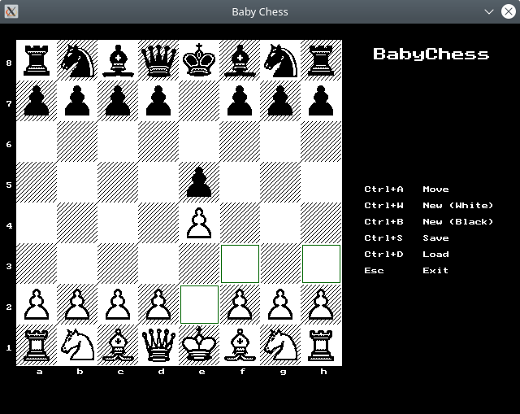
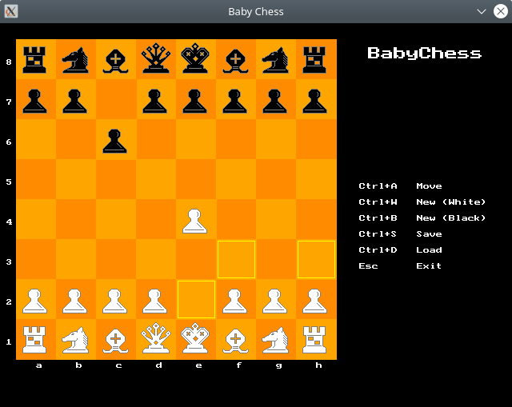

# Baby Chess

[Baby Chess](https://github.com/evgeniykorniloff/baby-chess) by Evgeniy Korniloff ported to Free Pascal and ptcGraph.

## Graphics

Baby Chess for ptcGraph has two chess pieces set.

The original pieces have been restored with kind help of [RetroNick](https://github.com/RetroNick2020).



The new pieces come from [Warlord chess program](https://www.chessprogramming.org/Warlord) by William H. Rogers.



## Build

```
make
```

To use the original pictures:

```
make original
```

