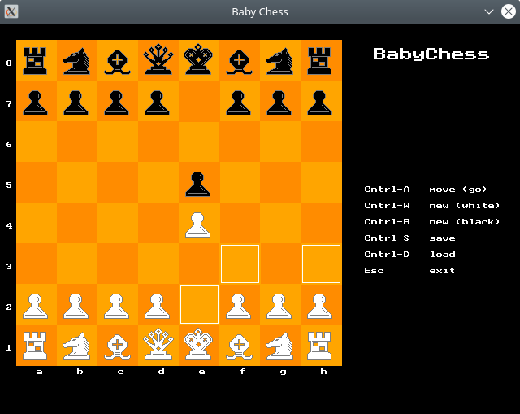

# Baby Chess

[Baby Chess](https://github.com/evgeniykorniloff/baby-chess) by Evgeniy Korniloff ported to Free Pascal and ptcGraph.



## Graphics

The chess pieces come from Warlord by William H. Rogers.

## Build

```
make
```

To use the original pictures:

```
make original
```

Currently the original pictures are not available. You will see numbers instead of chess pieces.
